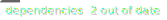

---
<!-- START include.md --><svg width="100" height="100" xmlns="http://www.w3.org/2000/svg">
  <foreignObject width="100%" height="100%">
    

 
 
 
 
 
    

    </foreignObject>
</svg>

Data from DummyFile.md - Modified-now

<!-- END include.md --> 

Data from DummyFile.md - Modified-now
