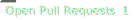
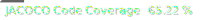
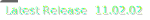

### `header`

**Required** The header of your README.md. Markdown supported.

### `subhead`

The subheader of your README.md. Markdown supported. Default `""`.

### `footer`

The footer of your README.md. Markdown supported. Default `""`.

